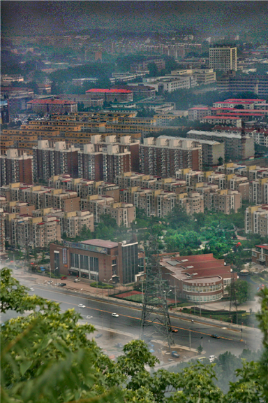

# Image Dehazing, the end.

<!-- style settings -->
<!-- <style>
.center 
{
  width: auto;
  display: table;
  margin-left: auto;
  margin-right: auto;
}
</style> -->
<!-- style settings -->

```
chenghua Wang, Feb 2 2023

chenghua.wang.edu@gmail.com
```

**Keywords**: *dehaze*, *defog*, *deep learning*, *computer vision*

## Table of Contents

- [介绍](#介绍)
- [上手dehazing的建议](#上手dehazing的建议)
- [目前dehazing的主要问题](#目前dehazing的主要问题)
  - [数据集](#数据集)
  - [先验-网络-end2end](#先验-网络-end2end)
  - [过拟合-还是-DomainGap](#过拟合-还是-DomainGap)
- [一些好玩的idea](#一些好玩的idea)
  - [数据集改进](#数据集改进)
  - [只当作数值问题来考虑](#只当作数值问题来考虑)
  - [迭代级联，模型选择是正确的吗？](#迭代级联模型选择是正确的吗)
- [一些实验结果](一些实验结果)
- [总结](#总结)
- [citing](#citing)
- [issues](#issues)

## 介绍

这里的the end并不是说终结了去雾课题，而是为期一年的去雾研究落幕了(Jan 1 2022 -> Dec 31 2022)，开始准备考研去了。之后大概率也不会再研究去雾这个课题了，在这篇文章中记录了这段时间去雾的一些体会和思考内容。虽然我只是半只脚入门计算机视觉的小白，此文全是一家之谈，但是也希望这篇文章能为近期研究去雾的同志们带来一点启发。

古早的传统图像处理方法(Hazy line<sup><a href="#ref2">[2]</a></sup>，DCP<sup><a href="#ref3">[3]</a></sup>等)在去雾上还是别有一番风味的，但是重量级武器(深度学习)上马以后，去雾领域却是一言难尽。

下文将首先给出上手去雾研究的建议；相关的工作就不阐述了，想必大家了解的应该比我更多；之后分析目前工作的问题和去雾这个问题本身的难点；其次提出我目前的一些Idea；最后，给出我目前的实验结果和总结。

## 上手dehazing的建议

读论文、分析论文之类的就不说了，这些都是研究者的一些基本的必备素质。这里主要说的就是以何种心态和想法去做去雾研究。众所周知，去雾这个课题，目前来说还没有成对的数据集，对于数据驱动的深度学习方法来说，这是灾难性的。在测试当前网络的性能指标的时候，一共有两种选择：1. 尽力的提高在人造数据集上的指标(当然，这是没有任何意义的，人造数据集和真实数据集的差异实在太大，卷人造数据集上的指标有虚空打靶，自我陶醉之意。当然，一切为了生活/毕业嘛) 2. 只关注真实数据集上的去雾效果(这是办实事的研究，但是，对于ill posed+缺少数据集的去雾问题，使用深度学习的方法，必须做好毫无进展的准备)

<details>
<summary>[1. 卷人造数据集指标(click to expand)]</summary>
<br>

- 显然，这样的选择应该是多数的(为了生活/毕业)。如果是这样的目的就非常好办了，广泛阅读文章，找到一些漏洞，缝合/寻找新设定/为网络编造新的故事/挑选几张好的图片(ps下)/进行不公平对比/不跟sota进行对比。

<p align="center">❗❗❗学术不端是严重的罪行，我坚决抵制这些行为❗❗❗</p>

- 不那么虚一点的。我认为可以尝试在小地方进行改进(当然要发文章的话，期刊/会议等级不会太高)。
  - 技术报告类型的文章
  - 在某些微小操作上改进，普适性的。(比如旷视的文章<sup><a href="#ref6">[6]</a></sup>，这篇文章的出发点非常好，当然，这篇文章不在这个“贬义”的section内)

</details>

<details>
<summary>[2. 义愤填膺的想搞出真东西(click to expand)]</summary>

<br>

- 这是一条非常艰难的路子(实际上，我是持劝退态度的，或许换一个有好的数据集，setting还算可以的课题更容易出扎实的成果)。去雾领域虽然目前有很多的文章可以借鉴参考，但是我认为还是处于非常初级的阶段，并没有非常扎实可行的主要研究方向。**希望读者在选择去雾这个课题上慎重考虑❗❗❗**

- 如果读者执意要在去雾上做出成果，那么我向你表示感谢，并且由衷的希望你能做出很好的成果，甚至终结目前去雾领域的一些怪象。也希望我在下文中阐述的一些观点能够给你启发。再次祝你研究顺利。

- 如此，你需要在数据集乃至算法进行全面的改进。弥补真实数据集和人造数据集的差别，或者找到合适的先验来弥补网络在错误数据集上学习造成的偏差。

- 实际上，对于做出真的能够在真实图像上可行的算法，我无法提出啥确切建议，可以看下下文中的Idea。

</details>

---

但是不论如何，下面提到的这些还是对于研究大有益处的：

- 去雾属于 low-level 任务，在研究上来说，不应该太受 high-level 领域的一些算法设计方法的影响，二者是不一样的。对于 low-level 任务，我认为应当更多的关注于数字图像处理和计算摄影方面的内容。

  - 数字图像处理的内容读者应该都上过课程或者读过书学习过了。

  - <details><summary>[Shree K. Nayar from Columbia University，计算摄影(click to expand)]</summary>
    <br>

    [个人主页URL](https://www.cs.columbia.edu/~nayar/), [课程URL](https://fpcv.cs.columbia.edu/)
    </details>

  - <details><summary>[Michael S. Brown from York University，计算摄影(click to expand)]</summary>
    <br>
    
    [个人主页URL](http://www.cse.yorku.ca/~mbrown/)
    
    [ICCV 2019 Tutorial URL, Understanding Color and the In-Camera Image Processing Pipeline for Computer Vision](https://www.eecs.yorku.ca/~mbrown/ICCV2019_Brown.html)
    </details>

## 目前dehazing的主要问题

我始终认为，如果要使用深度学习方法，解决**大量成对真实数据集**的问题(如何模拟出现实场景中的雾)是去雾里面最重要的点。好的先验是其次的，好的网络设计是最后的，然后才是调参数。最后，对于如何评价网络性能的优劣，也缺少一个合适的方法(在 low-level 的大部分任务中都缺少一个合适的评价指标)

<p align="center"></p>

### 数据集

在去雾中，最常使用的物理模型是:

$$
I = J \times t + A \times (1-t)
$$

其中 $I$ 表示退化后的图片； $J$ 表示清晰的图片； $t=e^{-\beta d(x)}$，其中 $d(x)$ 是深度； $A$ 是大气光值。实际上，如果我们直接用网络估计 $t$ 和 $A$，或者估计与 $t$ 和 $A$ 相关的值，可以把这个公式退化成一个简单的线性拉伸/加权平均(除非强监督 $t$, $A$，否则无法说明网络到底学了个什么值)。

1. 去雾没有大量的成对数据集

    我在文中多次谈到了这一点，大量的成对真实数据集对于端到端的方法来说是极其重要的(当然对于大多数监督方法来说都是这样的)。对于**单幅图像**去雾，不论是不是基于物理模型的端到端，不论这几个物理量有没有监督，**这都是一个无中生有的行为**，这些全都靠网络学到的方式来进行映射，数据集就变得尤为重要了(可以参考生成模型)。

2. 现实中的雾不是均质的

    现实中的雾在前后景交界线的位置会出现明显的浓度偏差，在具有白色物体的场景处，也会对深度网络的去雾造成困扰。使用现有的人造雾模型 $I = J \times t + A \times (1-t)$ 不能很好的模拟出非均质的雾，这也就造成了目前许多算法”泛化性“差的问题。

3. 现有的数据集多样性不够

    现在的数据集的物体种类，或者说颜色的多样性是比较不足的。如果把去雾任务仅仅当作一个颜色矫正的任务，那么GT的颜色多样性是需要有保障的。

### 先验-网络-end2end

我认为**一个好的先验胜过一个好的网络(A better prior is better than better models，与上文的图片对仗？)**。

因为我们缺少好的数据，所以我们必须加入更多的人工先验来缩小解搜索的空间。其实在人工先验上有不少的学者做了研究，很多好的成果发的文章并不是在很高的期刊/会议上。

现在很多的网络在使用端到端的方法来做去雾，抛弃了物理模型，抛弃了人工先验。我是很抵触端到端的网络的，因为端到端是从一个域到另一个域，没有好的数据集能做啥映射呢？

### 过拟合-还是-DomainGap

现在许多的网络方法在指标上非常的高，但是在实际的数据集上，效果并不好。很多时候人们说：“先提高指标，再考虑如何提高泛化性能。（或者说：得一步步走，慢慢来）”，**但是，前提是数据集和真实数据本身是一个 Domain 内的，二者偏差不大**。在去雾中，尚没有人探讨过使用大气光照模型产生的雾和真实的雾的差别，但我想，差别还是非常大的，甚至如卡通图像和写实图像一样大的gap。

<p align="center"><em>
也就是说，我们得考虑：这个gap是“泛化性”不足，还是gap已经大到domain transfer的范畴了？
</em></p>

如果gap确实大到domain transfer的范畴了，那么各种“泛化性”的tricks就没必要再上了。我们可能需要像Bring Old Photo Back to Life<sup><a href="#ref4">[4]</a></sup>中提到的方法了。

现在还有很多的工作在人造数据集上测试指标，并且还在不断的提升这个指标，是不是已经开始过拟合数据集了呢？目前的进展是不是已经南辕北辙了呢？神经网络拟合数据的能力是非常强大的，甚至连我下文中提到的超像素方法生成的数据集都可以完全的过拟合(使用我设计的非常naive的网络)，如下:

<table>
    <tr>
        <td ><center> pic 1 hard-sample(Hazed, GT, Dehazed)</center></td>
    </tr>
    <tr>
        <td ><center> pic 2 hard-sample(Hazed, GT, Dehazed)</center></td>
    </tr>
    <tr>
        <td ><center> pic 3 hard-sample(Hazed, GT, Dehazed)</center></td>
    </tr>
    <tr>
        <td><center>这里展示的数据都是困难样本(loss从大到小排序的前几位)</center></td>
    </tr>
</table>

<details><summary>[click to check more]</summary>
<table>
    <tr>
        <td ><center> pic 4 hard-sample(Hazed, GT, Dehazed)</center></td>
    </tr>
    <tr>
        <td ><center> pic 5 hard-sample(Hazed, GT, Dehazed)</center></td>
    </tr>
    <tr>
        <td ><center> pic 6 hard-sample(Hazed, GT, Dehazed)</center></td>
    </tr>
    <tr>
        <td><center>这里展示的数据都是困难样本(loss从大到小排序的前几位)</center></td>
    </tr>
</table>
</details>

所以啊，我挺怀疑目前已经开始过拟合人造数据集了。但是也没办法，文章里面总得拿个指标说事吧？也希望有好的评价指标能够出来。

## 一些好玩的idea

### 数据集改进

1. 使用超像素的方法来改进(并不是非常好)

    这个数据集是Non-homogeneous haze data synthesis based real-world image dehazing with enhancement-and-restoration fused CNNs<sup><a href="#ref5">[5]</a></sup>.提出的，大家可以看看做法。基本上就是通过在原图上的超像素划分，在划分的区域上进行不同浓度的加雾。如上文中已经展示的[link](#过拟合-还是-domaingap)图片，这些图片是使用超像素方法来生成的。在实验结果上，虽然图更假了，但是在“泛化性”上来说，效果不错(这个数据集挺挑网络的)。

    但是超像素以后，这个数据集看起来和真实的数据集gap更大了。也许这是一种正则化作用？

2. 线性的雾生成

    我更倾向于在原本的 $t=e^{-\beta d(x)}$ 的模型的基础上进行一些改进，原本是全图一致性的，现在改成向着某一个方向渐变的。对于FCN网络，在某一个小块上，基本上是一个方向向着另一个方向渐进或者说变化的。这样相对于超像素的方法来说可能会更好。

3. 使用 CG ?

    现在CG对物体渲染的拟真度已经相当高了，或许我们可以使用CG技术来生成大量的人造数据集，从感官上来看，CG技术生成的图片与真实世界图片的gap还是比较小的。但是这是一个巨大的工作量(找到高精度的模型，放置好雾，需要技术美术参与，还需要渲染...)。

### 只当作数值问题来考虑

1. 去雾任务需要很多的区域统计信息
    
    我认为，很多区域性的统计信息在去雾中起着至关重要的作用。我们不难发现，现在很多的研究者在网络中加入这样的模块 $Output = \text{Concat}(\max{x}, \text{mean}{~x}, \min{x})$。这些模块有些使用了通道上的统计信息，有些使用了传统的 Pooling，但是不可否认的是，这样的小模块去雾是带来了很好的效果。实际上，这就是一种 **人工先验** 的嵌入，一个好的先验胜过一个精心设计的网络。

    观察很多的传统方法(11 年左右)，大多数的传统方法都是使用了图片的一个统计信息，不论是求最大最小还是方差等。**但是，卷积神经网络似乎非常难去表示一个区域统计性质的函数**，卷积网络非常适合去压缩信息，做重要性加权一类的事情，对于拟合一些大尺度上的具有区域的统计性质工作并不容易(比如统计某一个块内的方差和均值)。

    所以，我一直认为，在设计的深度网络里面，必须加入人为的先验模块，这个先验模块一定是用来做区域性颜色信息统计(比如统计某个区域内的最大最小值，均值，方差等)。当然，这个统计模块也是可以通过魔改pooling 来达到目的的，但是，我并不看好深度网络在缺乏数据集的情况下能够学到一些统计操作。

2. 数值上的一些小trick是管用的

    现在有许多的研究者在去雾任务中使用 InstanceNorm，不可否认的，这是正确的。我认为可以从数值角度上来考虑这件事情。在一个小区域内(雾是均匀的)，雾所造成的颜色影响实际上就是 $I = J * a + b$， $a,b$ 是拉伸系数，这些拉伸系数会把一个大的颜色范围(比如 0-128)压缩到小的范围(比如 250-255)，这就造成了发白的雾。所以使用这些式子来重新拉大颜色范围可以给神经网络更大的处理空间: $$Output = \frac{x-x_{min}}{x_{max}-x_{min}+\beta},\beta=1e-12$$ 或者 $$Output = \frac{x-x_{mean}}{x_{std}}$$

    > **但是，这也引出了一些问题**
    >
    > 在使用了全图统计信息的网络中(比如说 InstanceNorm，Global Pooling等)，因为训练和测试的图片尺寸不匹配会造成非常大的偏差，旷视的一篇文章<sup><a href="#ref6">[6]</a></sup>探讨过这个问题。

### 迭代级联，模型选择是正确的吗？

很多的研究者受模型选择和 Stable Diffusiuon 或者是 Inverse Network的启发，想用不同的模型或者是渐进式的方法来做到去雾；模型选择和迭代要分开看待，但是还是那句话，**这些假设出来的数学模型非常的吃数据(但是无法否定，如果你用数学式子表达出迭代的去雾公式，还是非常优美的)**。

1. 对于模型选择

    我认为，目前的难点是真实数据和训练数据很大的不一致导致的。使用模型选择很难去缓解这个问题，反而，模型选择会加剧过拟合。

2. 对于迭代算法

    迭代算法我认为是有成功的可能性的，但是需要一些无监督/半监督的方法辅助。因为迭代方法实际上是在一个参数范围内穷举。但是何时停止，何种情况下的图片可以定义为无雾是要一些评价指标来判定的。但是，目前没有合适的无参考评价指标。

## 一些实验结果

<table>
    <tr>
        <td ><center> pic 1(a) real-world id=3</center></td>
        <td ><center> pic 1(b) dehazed id=3</center></td>
    </tr>
    <tr>
        <td><center> pic 2(a) real-world id=5</center></td>
        <td ><center> pic 2(b) dehazed id=5</center> </td>
    </tr>
    <tr>
        <td><center> pic 3(a) real-world id=104</center></td>
        <td ><center> pic 3(b) dehazed id=104</center> </td>
    </tr>
    <tr>
        <td><center><br>pic 4(a) real-world id=8</center></td>
        <td ><center><br>pic 4(b) dehazed id=8</center> </td>
    </tr>
    <tr>
        <td><center><br>pic 5(a) real-world id=12</center></td>
        <td ><center><br>pic 5(b) dehazed id=12</center> </td>
    </tr>
</table>

<details>
<summary>[click to check more]</summary>
<table>
    <tr>
        <td ><center><br>pic 6(a) real-world id=13</center></td>
        <td ><center><br>pic 6(b) dehazed id=13</center></td>
    </tr>
    <tr>
        <td><center><br>pic 7(a) real-world id=14</center></td>
        <td ><center><br>pic 7(b) dehazed id=14</center> </td>
    </tr>
    <tr>
        <td><center><br>pic 8(a) real-world id=68</center></td>
        <td ><center><br>pic 8(b) dehazed id=68</center> </td>
    </tr>
</table>
</details>

## 总结

在去雾的领域内，自从深度学习这个重磅武器进入后，反而研究质量变差了，在真实图像的泛化性上，很多的网络甚至都不能和传统的方法掰手腕，这非常的让人沮丧。对于没有成对数据，而且还是ill-posed的问题，深度学习方法目前并没有很好的办法来解决。希望有研究者能够改变目前去雾领域的怪象，做出踏实的结果。

以上是我的一家之谈，我参与到去雾的研究时间不长，本文逻辑也较为混乱，各位大佬们轻喷，也希望大家能指正错误。

最后，祝各位读者学习、研究顺利，身体健康，生活愉快。

## citing

```txt
@misc{imagedehzetheend,
  author = {chenghua Wang},
  title = {Image Dehazing, the end.},
  url = {https://github.com/chenghuaWang/image-dehazing-the-end},
  year = {2023},
  note = {Version 1.0}
}
```

## issues

非常欢迎大家在 issues 中友好和谐的讨论问题，贴出自己的见解和在真实数据集上的实验结果。

---

*Reference*

1. <p name="ref1">Li, Boyi, Wenqi Ren, Dengpan Fu, Dacheng Tao, Dan Feng, Wenjun Zeng and Zhangyang Wang. “RESIDE: A Benchmark for Single Image Dehazing.” ArXiv abs/1712.04143 (2017)</p>

2. <p name="ref2">Fattal, Raanan. “Dehazing Using Color-Lines.” ACM Transactions on Graphics (TOG) 34 (2014): 1 - 14.</p>

3. <p name="ref3">He, Kaiming, Jian Sun and Xiao Jie Tang. “Single Image Haze Removal Using Dark Channel Prior.” IEEE Transactions on Pattern Analysis and Machine Intelligence (2011)</p>

4. <p name="ref4">Wan, Ziyu, Bo Zhang, Dongdong Chen, P. Zhang, Dong Chen, Jing Liao and Fang Wen. “Bringing Old Photos Back to Life.” 2020 IEEE/CVF Conference on Computer Vision and Pattern Recognition (CVPR) (2020): 2744-2754.</p>

5. <p name="ref5">Liu, Chunxiao, Shuangshuang Ye, Lideng Zhang, Haiyong Bao, Xun Wang and Fanding Wu. “Non-homogeneous haze data synthesis based real-world image dehazing with enhancement-and-restoration fused CNNs.” Comput. Graph. 106 (2022): 45-57.</p>

6. <p name="ref6">Chu, Xiaojie, Liangyu Chen, Chengpeng Chen and Xin Lu. “Improving Image Restoration by Revisiting Global Information Aggregation.” European Conference on Computer Vision (2021).</p>